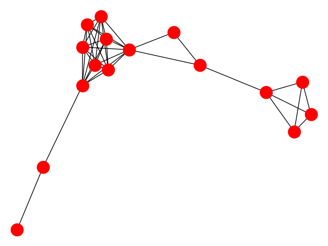
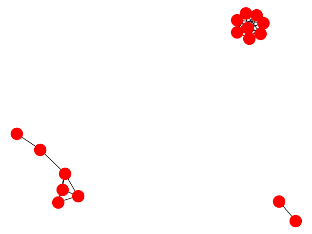
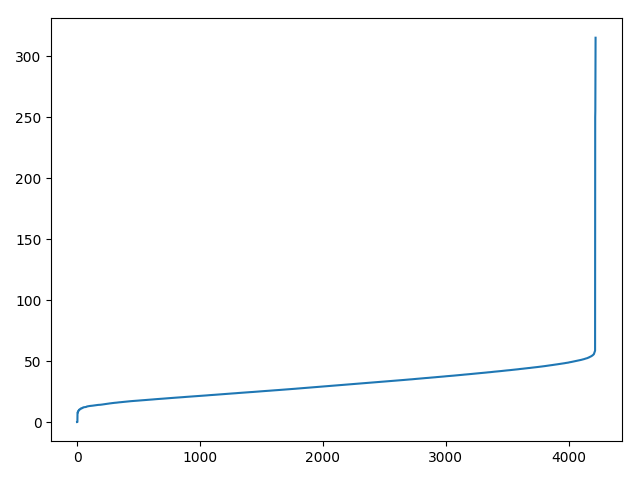

# Community detection
- We tried both spectral clustering and hierarchical clustering using the Girvan-Newman algorithm
- The Girvan Newman algorithm was simply too slow. In practice, it took several minutes for just one betweenness
calculation

## Girvan-Newman
- Detected the same number of clusters as spectral clustering approach
- Based on random observations, cluster appeared to be the same as produced by spectral clustering
- However, it took **3 hours** to find these clusters. After removal of edge *e*, we calculate all shortest paths again,
to find the betweenness centrality. This is not necessary, as we only have to update the shortest paths that used *e*.

### Examples
- In this mock data example, we first show the initial graph with one connected component

- After the Girwan-Newman algorithm finishes, the level with three connected components is found to have the highest
modularity

## Spectral clustering
- In order to detect the amount of clusters, we plotted the values of the second eigenvector
- This clearly showed that there were 4 communities, some severally bigger than others

- Given our knowledge that **k=4**, we ran the k-means clustering algorithm on the eigenvector in order to assign to
each person a cluster
- We also tried plotting the eigenvalues 

## Friendship issues
- One of our biggest issues were related to pre-processing
- We were lowercasing all names, but it turns out that there are different people with the same name, although with
different casing

# Sentiment analysis
- We noticed a significant different in the sizes of the positive and negative classes.
This may have affected the results, but initially we disregarded the imbalance.
- We chose a Naive Bayes classifier as our model, mostly due to it being simple yet yielding accurate results.
Being simple, we can train it quickly and try different approaches. We can also perform cross validation more easily.

## Initial results
- Our initial results showed a **91.2%** accuracy, however with a precision of **93.23%** on the positive class and
**78.49%** on the positive class. Due to the imbalance in our dataset, we decided to use undersampling
- After balancing the dataset, we got an accuracy of **87%**. However, we still need to test which effect stemming and
negation has on the dataset

### Trial #1 scores (imbalanced dataset, 91% accuracy)
         precision    recall
    
    neg       0.78      0.64
    pos       0.93      0.96

### Trial #2 scores (balanced dataset, 87% accuracy)
         precision    recall
    
    neg       0.89      0.85
    pos       0.86      0.89
    
## Stemming
- We expect a slight decrease in accuracy when using stemming, as we risk losing the meaning of some word    
- Actually, stemming did not change much and its slightly change in accuracy may be accredited to using random
undersampling. Ideally, we would 

### Trial #3 scores (balanced dataset, stemming, 86% accuracy)
         precision    recall
    
    neg       0.88      0.84
    pos       0.85      0.88      

## Negation
- We expect an increase in accuracy when using negation
- For every negative word, we prepend each following word with *NEG_* until we encounter punctuation
- To our surprise, the accuracy actually decreased. The precision on the negative class is comparatively higher than the
precision on the negative class, which intuitively makes sense as the model might associate certain *NEG_* words with
a negative sentiment

## Trial #4 scores (balanced dataset, negation, 83% accuracy)
         precision    recall
    
    neg       0.86      0.79
    pos       0.80      0.87   
 
## Cross-validation
- Due to the time overhead, we did not have time to implement k-fold cross-validation. However, since we use random
undersampling, we can use Monte Carlo cross-validation 
- We ran random undersampling 5 times on the datasets (except the unbalanced one), where a random subset is used for
training and the same subset is used for testing
- The variances in the resulting metrics were quite low. In particular, the variance on the accuracy metric in the last
 dataset was **0.03**, whereas the mean value of that metric was **86.8%**

# Combining models
- Our sentiment model has a higher chance of labelling the reviews positive than negative, as seen with the recall when
testing against our testset
This means that we are more likely to say that a user would purchase fine food. However, the precision on the positive
class is lower than that of the negative class, so in many cases where we guess positive, the ground truth is negative.
This is why the majority fractions of our communities wish to buy fine foods
- We tested the accuracy, precision and recall against the results.txt that were give (seen below). The results supports our theory,
that is is better at predicting positive than negative reviews. It is actually quite bad at labelling the negative 
reviews

|     |  Precision |  Recall |
|-----|-----------:|--------:|
| Pos |      0.981 |   0.851 |
| Neg |      0.488 |   0.893 |

- We correctly labels almost all positive reviews but fail to classify half of the negative reviews
- There is therefore a very high chance of us labelling the review positive. When aggregating the opinions of multiple 
friends it is almost certain to be positive. The table below shows the fraction of the community that would by fine 
foods
- We assumed that 'kyle' did not have 10*10 times the influence when not in the same community, but only ten
- When compared to the results dataset, it was not that accurate. This might be the result of different 
community splits but also the result of different classifications of reviews

|            | Would by fine food |
|------------|-------------------:|
|Community 0 |              0.763 |
|Community 1 |              0.876 |
|Community 2 |              0.837 |
|Community 3 |              0.955 |

# Evaluation
- The graph in spectral clustering has quite clear divisions, meaning that our split is most likely correct
- The accuracy of our ml model is okay, but is really unbalanced, biased towards positive posts. We therefore do not 
classify negative reviews correctly, most communities are therefore willing to buy fine foods
- As both the communities and the model most likely do not make the exact same choices along the way, it is expected
to give somewhat different results
- The classifier is binary, that means that stronger opinions (1 or 5) do not have a say in the calculation. 
Having multiple classes would probably giver better when combining the models, though the measures would probably also
fall because of the increased complexity
- Content based recommender systems can be generated for a single user and therefore do not need a community.
On the other hand, a content based recommender systems needs information from the user, like ratings, this is not 
necessary for all users in this system, as we can draw information from a users friends
